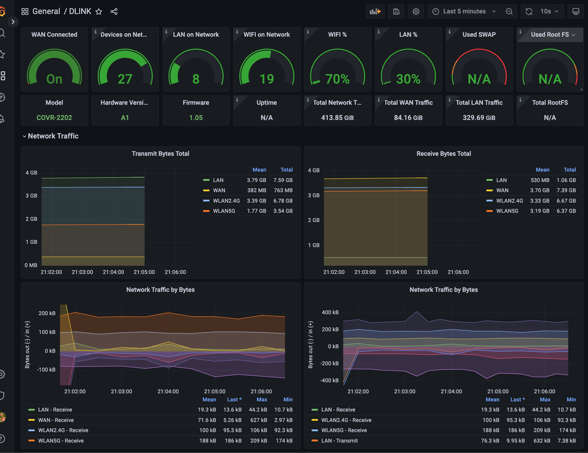

# Prometheus Exporter for the COVR200 Modem
this is a fork of the https://github.com/Beaujr/prometheus-dlink-exporter

aiming to work with DLINK COVR 2200. Currently its a work in progress, and the code is subpar focusing on results.

## Whats working? 

### Dashboard:
[This is a WIP Dashboard](./grafana/dashboard.json)


Assumes the
- prometheus job is called `router`
- the port is `9731`
- the host is `router`

### Metrics
Sample Query

`irate(node_network_receive_bytes_total{instance=~"router:9731",job=~"router", device!="WAN"}[5m])/1024`


Exporting the following metrics
via: 

`prometheus-moto-exporter --endpoint "http://192.168.1.1/HNAP1/" --username Admin --password <password> --debug --bind "0.0.0.0:9731"`


```
node_device_hardware_info{boot_file="",customer_version="COVR-2202",hardware_version="A1",serial="Medeleine",software_version="1.05",spec_version="COVR-2200"} 1
node_network_client_interface{Type="LAN"} 9
node_network_client_interface{Type="OFFLINE"} 5
node_network_client_interface{Type="WiFi_2.4G"} 11
node_network_client_interface{Type="WiFi_2.4G_MeshExtender"} 1
node_network_client_interface{Type="WiFi_5G"} 8
# HELP node_network_client_signal Network Clients signal
# TYPE node_network_client_signal gauge
node_network_client_signal{DeviceName="macbook",MacAddress="FA:KE:MA:CA:DR:ES",NickName="BeausMBP",ReserveIP="192.168.1.237",Type="WiFi_2.4G"} 79
# HELP node_network_client_state Network Clients status
# TYPE node_network_client_state gauge
node_network_client_state{DeviceName="",MacAddress="FA:KE:MA:CA:DR:ES",NickName="BeausMBP",ReserveIP="192.168.1.237",Type="WiFi_2.4G"} 1
# HELP node_network_receive_bytes_total received bytes
# TYPE node_network_receive_bytes_total gauge
node_network_receive_bytes_total{device="LAN",interface_id="NO:TA:RE:AL:MA:C1"} 5.40385677e+08
node_network_receive_bytes_total{device="WAN",interface_id="NO:TA:RE:AL:MA:C1"} 3.690473172e+09
node_network_receive_bytes_total{device="WLAN2.4G",interface_id="NO:TA:RE:AL:MA:C1"} 3.391108799e+09
node_network_receive_bytes_total{device="WLAN5G",interface_id="NO:TA:RE:AL:MA:C1"} 3.151773323e+09
# HELP node_network_receive_packets_total RXPackets status
# TYPE node_network_receive_packets_total gauge
node_network_receive_packets_total{device="LAN",interface_id="NO:TA:RE:AL:MA:C1"} 4.276643e+06
node_network_receive_packets_total{device="WAN",interface_id="NO:TA:RE:AL:MA:C1"} 3.193817e+06
node_network_receive_packets_total{device="WLAN2.4G",interface_id="NO:TA:RE:AL:MA:C1"} 4.777394e+06
node_network_receive_packets_total{device="WLAN5G",interface_id="NO:TA:RE:AL:MA:C1"} 4.286088e+06
# HELP node_network_transmit_bytes_total sent bytes
# TYPE node_network_transmit_bytes_total gauge
node_network_transmit_bytes_total{device="LAN",interface_id="NO:TA:RE:AL:MA:C1"} 3.786262581e+09
node_network_transmit_bytes_total{device="WAN",interface_id="NO:TA:RE:AL:MA:C1"} 3.91570885e+08
node_network_transmit_bytes_total{device="WLAN2.4G",interface_id="NO:TA:RE:AL:MA:C1"} 3.415691373e+09
node_network_transmit_bytes_total{device="WLAN5G",interface_id="NO:TA:RE:AL:MA:C1"} 1.757743152e+09
# HELP node_network_transmit_packets_total TXPackets status
# TYPE node_network_transmit_packets_total gauge
node_network_transmit_packets_total{device="LAN",interface_id="NO:TA:RE:AL:MA:C1"} 3.51805e+06
node_network_transmit_packets_total{device="WAN",interface_id="NO:TA:RE:AL:MA:C1"} 1.565734e+06
node_network_transmit_packets_total{device="WLAN2.4G",interface_id="NO:TA:RE:AL:MA:C1"} 8.550544e+06
node_network_transmit_packets_total{device="WLAN5G",interface_id="NO:TA:RE:AL:MA:C1"} 8.413339e+06
```


Source README.md below

------
This is a prometheus exporter written with the intention of exporting metrics for a Motorola MB8600 device.

My device, as configured by the CableTown ISP service, has SNMP disabled. With SNMP disabled, I wanted another route to be able to collect these metrics.

## Build it

The exporter can build with the common `go get`, `go build`, or `go install` usages.

To explicitly pull and build from its GitHub repository:

``` bash
git clone https://github.com/jahkeup/prometheus-moto-exporter
cd prometheus-moto-exporter
go build ./cmd/prometheus-moto-exporter
```

Then either call the tool at its path or put it in your `$PATH`.

## Using it

Given an address for the device, which by default is `192.168.100.1`, a fully constructed "endpoint" URL looks like `https://192.168.100.1/HNAP1/`.
This endpoint provides the [HNAP](https://en.wikipedia.org/wiki/Home_Network_Administration_Protocol) SOAP service on the device.
The exporter uses this SOAP service to fetch metrics for each channel, up and downstreams, and other bits of metadata related to the operation of the device.
Because this device is a dedicated _modem_, you may have your device behind a handy router with a firewall that's configured to block all LAN traffic to the device.
`prometheus-moto-exporter` is written in Go and is generally able to be compiled for these hosts - for instance, I have this running on a FreeBSD host that is the only host on the network with access to the modem.
If you want to expose these metrics to your prometheus scraper, then adjust the `--bind` address to meet your needs.

``` bash
prometheus-moto-exporter --help

Exporter for Motorola modems equipped with HNAP

Usage:
  prometheus-moto-exporter [flags]

Flags:
      --bind string       http server bind address (default "127.0.0.1:9731")
      --debug             enable debug logging
      --endpoint string   modem HNAP endpoint (default "https://192.168.100.1/HNAP1/")
  -h, --help              help for prometheus-moto-exporter
      --password string   modem HNAP password (default "motorola")
      --username string   modem HNAP username (default "admin")
  -v, --version           version for prometheus-moto-exporter

```

## See it - `/metrics`

The metrics exported by the server will look a lot like this:

``` text
# HELP moto_collection_seconds 
# TYPE moto_collection_seconds histogram
moto_collection_seconds_bucket{le="1"} 0
moto_collection_seconds_bucket{le="5"} 0
moto_collection_seconds_bucket{le="10"} 70
moto_collection_seconds_bucket{le="15"} 70
moto_collection_seconds_bucket{le="30"} 70
moto_collection_seconds_bucket{le="45"} 70
moto_collection_seconds_bucket{le="60"} 70
moto_collection_seconds_bucket{le="+Inf"} 70
moto_collection_seconds_sum 619.4129969439999
moto_collection_seconds_count 70
# HELP moto_device_connected_status channel locked status
# TYPE moto_device_connected_status gauge
moto_device_connected_status{serial="4321-MB8600-1234"} 1
# HELP moto_device_hardware_info channel locked status
# TYPE moto_device_hardware_info gauge
moto_device_hardware_info{boot_file="d11_m_mb8600_some_service.cm",customer_version="Prod_18.2_d31",hardware_version="V1.0",serial="4321-MB8600-1234",software_version="8600-18.2.17",spec_version="DOCSIS 3.1"} 1
# HELP moto_downstream_channel_corrected_total corrected symbols
# TYPE moto_downstream_channel_corrected_total gauge
moto_downstream_channel_corrected_total{channel="1",channel_id="33",modulation="QAM256"} 50712
...
moto_downstream_channel_corrected_total{channel="7",channel_id="10",modulation="QAM256"} 84043
moto_downstream_channel_corrected_total{channel="8",channel_id="11",modulation="QAM256"} 2702
moto_downstream_channel_corrected_total{channel="9",channel_id="12",modulation="QAM256"} 1239
# HELP moto_downstream_channel_frequency channel frequency in Hz
# TYPE moto_downstream_channel_frequency gauge
moto_downstream_channel_frequency{channel="1",channel_id="33",modulation="QAM256"} 6.63e+08
...
moto_downstream_channel_frequency{channel="8",channel_id="11",modulation="QAM256"} 5.25e+08
moto_downstream_channel_frequency{channel="9",channel_id="12",modulation="QAM256"} 5.31e+08
# HELP moto_downstream_channel_locked channel locked status
# TYPE moto_downstream_channel_locked gauge
moto_downstream_channel_locked{channel="1",channel_id="33",modulation="QAM256"} 1
...
moto_downstream_channel_locked{channel="8",channel_id="11",modulation="QAM256"} 1
moto_downstream_channel_locked{channel="9",channel_id="12",modulation="QAM256"} 1
# HELP moto_downstream_channel_power_dbmv channel power level in dBmV
# TYPE moto_downstream_channel_power_dbmv gauge
moto_downstream_channel_power_dbmv{channel="1",channel_id="33",modulation="QAM256"} -9.3
...
moto_downstream_channel_power_dbmv{channel="8",channel_id="11",modulation="QAM256"} -9.8
moto_downstream_channel_power_dbmv{channel="9",channel_id="12",modulation="QAM256"} -10.2
# HELP moto_downstream_channel_signal_noise_ratio signal to noise ratio measured in dB
# TYPE moto_downstream_channel_signal_noise_ratio gauge
moto_downstream_channel_signal_noise_ratio{channel="1",channel_id="33",modulation="QAM256"} 39.7
...
moto_downstream_channel_signal_noise_ratio{channel="31",channel_id="35",modulation="QAM256"} 39.4
moto_downstream_channel_signal_noise_ratio{channel="32",channel_id="36",modulation="QAM256"} 39.3
moto_downstream_channel_signal_noise_ratio{channel="33",channel_id="159",modulation="OFDM PLC"} 21.5
# HELP moto_downstream_channel_uncorrected_total uncorrected symbols
# TYPE moto_downstream_channel_uncorrected_total gauge
moto_downstream_channel_uncorrected_total{channel="1",channel_id="33",modulation="QAM256"} 18995
moto_downstream_channel_uncorrected_total{channel="10",channel_id="13",modulation="QAM256"} 9.136921e+06
...
moto_downstream_channel_uncorrected_total{channel="8",channel_id="11",modulation="QAM256"} 8957
moto_downstream_channel_uncorrected_total{channel="9",channel_id="12",modulation="QAM256"} 5313
# HELP moto_upstream_channel_frequency channel freqency in Hz
# TYPE moto_upstream_channel_frequency gauge
moto_upstream_channel_frequency{channel="1",channel_id="1",modulation="SC-QAM"} 1.73e+07
moto_upstream_channel_frequency{channel="2",channel_id="2",modulation="SC-QAM"} 2.37e+07
moto_upstream_channel_frequency{channel="3",channel_id="3",modulation="SC-QAM"} 3.01e+07
moto_upstream_channel_frequency{channel="4",channel_id="4",modulation="SC-QAM"} 3.65e+07
# HELP moto_upstream_channel_locked channel locked status
# TYPE moto_upstream_channel_locked gauge
moto_upstream_channel_locked{channel="1",channel_id="1",modulation="SC-QAM"} 1
moto_upstream_channel_locked{channel="2",channel_id="2",modulation="SC-QAM"} 1
moto_upstream_channel_locked{channel="3",channel_id="3",modulation="SC-QAM"} 1
moto_upstream_channel_locked{channel="4",channel_id="4",modulation="SC-QAM"} 1
# HELP moto_upstream_channel_power_dbmv channel power level in dBmV
# TYPE moto_upstream_channel_power_dbmv gauge
moto_upstream_channel_power_dbmv{channel="1",channel_id="1",modulation="SC-QAM"} 52.8
moto_upstream_channel_power_dbmv{channel="2",channel_id="2",modulation="SC-QAM"} 52.3
moto_upstream_channel_power_dbmv{channel="3",channel_id="3",modulation="SC-QAM"} 52.8
moto_upstream_channel_power_dbmv{channel="4",channel_id="4",modulation="SC-QAM"} 51.8
# HELP moto_upstream_channel_symbol_rate instantaneous symbols per second rate
# TYPE moto_upstream_channel_symbol_rate gauge
moto_upstream_channel_symbol_rate{channel="1",channel_id="1",modulation="SC-QAM"} 5.12e+06
moto_upstream_channel_symbol_rate{channel="2",channel_id="2",modulation="SC-QAM"} 5.12e+06
moto_upstream_channel_symbol_rate{channel="3",channel_id="3",modulation="SC-QAM"} 5.12e+06
moto_upstream_channel_symbol_rate{channel="4",channel_id="4",modulation="SC-QAM"} 5.12e+06
```

### What works

I'm not 100% what devices will and won't work with this - you may find that it works with your model modem, or it may not.
Contributions are welcome, however please bias towards cutting an issue to discuss changes before.

#### Check

Test if your modem has HNAP by running the `check` subcommand.
The command will print out a single pass of metrics collected to perform the check.

``` bash
prometheus-moto-exporter check --endpoint "$myModem/HNAP1/"
```
